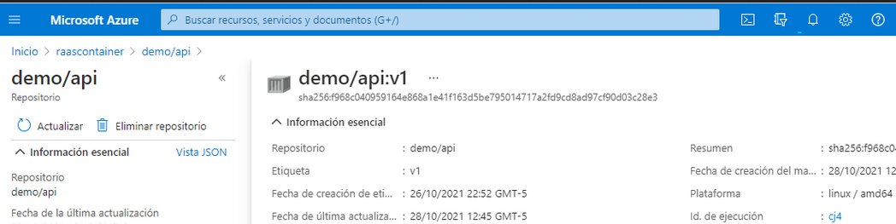

# API - remittances (v1.0)

> [Here](https://github.com/Team-capstone-machines/first_API) is the link to the "Remittances as a Service" application repository.

## Description :page_facing_up:
*An API designed for developers*

The remittances API has been created with the Python framework, Flask. It consists of 3 operations (receiver, history and phones), with a total of 8 endpoints. The complete documentation can be found at Stoplight: [here](https://themachines.stoplight.io/docs/remittances-as-a-service/)

It's REST -Representational State Transfer- architectural design allows to connect several systems based on the HTTP protocol using standard verbs (GET, POST, PUT and DELETE) to query or generate data, and return the queried data in a standard format such as JSON.

## Endpoints :dart:
We provide an API, `remittances`, which allows the creation of a new remittance, the access to the transaction history and the recording of encrypted and decrypted phone numbers. Here is a summary table of the operations:

**Server:** https://api-remittances.azurewebsites.net/api/v1
| VERB | PATH | METHOD |
|--|--|--|
| POST | /receiver | Create a new remittance |
| PUT | /receiver/{phone} | Updates a person's cash |
| GET | /receiver | Retrieves all transactions |
| GET | /receiver/{phone} | Retrieve remittances that correspond to a phone number |
| GET |  /history | Returns all the history of the total remittances |
| GET | /history/{phone} | Returns all the history of the total remittances to a phone number |
| GET | /phones | Returns all encrypted and unencrypted phone numbers |
| GET | /phones/{phone} | Returns of the phone desencryted of the phone specificied |

On the other hand, we use an API from our partner NUFI in the remittance application for identity validation in the process of sending or collecting remittances. [Here](https://docs.nufi.mx/docs/referencia-tecnica/b3A6NjM3NDU5OQ-enriquecimiento-de-identidades) the documentation.

**Server:** https://nufi.azure-api.net/enriquecimientoinformacion/v1/

| POST | /busqueda | Search for public information of persons on the network |
| -- | -- | -- |

## Errors :heavy_exclamation_mark:
Apart from the errors specified in the API documentation in Stoplight, we have implemented in the Remittances as a Service application the following errors corresponding to 4xx status codes:

| CODE | STATUS | MESSAGE |
| -- |--- | --|
| 400 | *Bad Request* | "Invalid name"; "Not a JSON"; "Missing name"; "Missing phone"; "Missing cash"; "field phone invalid format"; "Missing positive(+) or negative(-) sign" |
| 401 | *Unauthorized* | "Missing Pwd_NUFI"; "The nufi API key has been denied, make sure to send a valid API key and with an active subscription" |
| 404 | *Not Found* | "Phone id. Not found"; "Invalid amount. Cannot be processed" |
| 413 | *Request Entity Too Large* | "The petition 'name' exceeds the limits defined by the server" |
| 422 | *Unprocessable Entity* | "The record exists. POST not possible" |

## Features :bulb:
> Use of the most common HTTP status codes. They can be consulted in the API documentation as well as in the code implementation for our "Remittances as a Service" application.

>

>

## Deploy :rocket:
The deployment of this API is under a container registry named `raascontainer` which is deployed as an app service and contains a Docker container of the API application named `demo/api:v1`. All this through Microsoft Azure services.

## Authors :registered:
:woman_technologist: **Diana Parra**
* [GitHub](https://github.com/dianaparr)
* [Twitter](https://twitter.com/dianaparra017)

:man_technologist: **Brian Zapata**
* [GitHub](https://github.com/brian-1989)
* [Twitter](https://twitter.com/BrianZa03390210)

:man_technologist: **Victor Cuartas**
* [GitHub](https://github.com/vicuartas230/)
* [Twitter](https://twitter.com/vicuartas230)

***

### Technologies and tools :zap:

